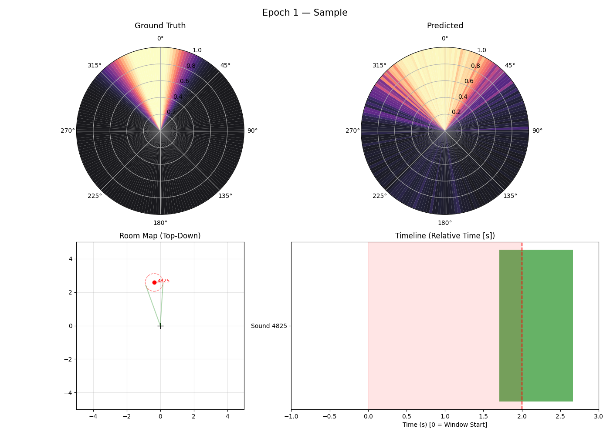

# 🎙️ Audio Locator: Real-Time Spatial Audio Localization

<p align="center">
  
  
  
</p>

**Audio Locator** is a neural network-based model designed to identify and track the azimuth of sound sources(in stereo audio) in real-time. 

The system generates synthetic data using HRTFs to simulate realistic sound propagation in a 3D space, then trains on it until it learns to precisely predict the azimuth of sound sources.

---

## 🌟 Key Features

- **🚀 Real-Time Localization**: Low-latency inference (>10Hz on a 5060 ti).
- **🎧 HRTF Understanding**: Uses slab's HRIRs for realistic and moving sound generation, with linear and circular trajectories around the listener.

<p align="center">
  
</p>


---

## 🛠️ Installation

This project uses [uv](https://github.com/astral-sh/uv) for package management.

```powershell
# Clone the repository
git clone https://github.com/xFrah/audio_locator.git
cd audio_locator

# Install dependencies and create venv
uv sync
```

---

### 📉 Training
Start training with the custom HRTF-based dataset generator:

```powershell
uv run train.py
```

*You can train on your own set of sounds by just putting the them inside the `sounds` folder.*


### ⚡ Real-Time Evaluation
Simulate and debug real-time processing on an existing audio file:

```powershell
uv run eval_realtime.py
```

*The default sound is "output/orbiting_sound.wav" which is generated by the `spatial_audio_generator.py` script.*

### 🔨 Data Generation
To generate a standalone dataset for debugging:

```powershell
uv run dataset.py
```

*The script outputs a stereo audio file with the sounds scattered around the listener, exactly the same as the dataset used for training.*

---

## 📄 License

This project is licensed under the Creative Commons Attribution-NonCommercial 4.0 International (CC BY-NC 4.0) License. 

See the [LICENSE](LICENSE) file for the full text.
